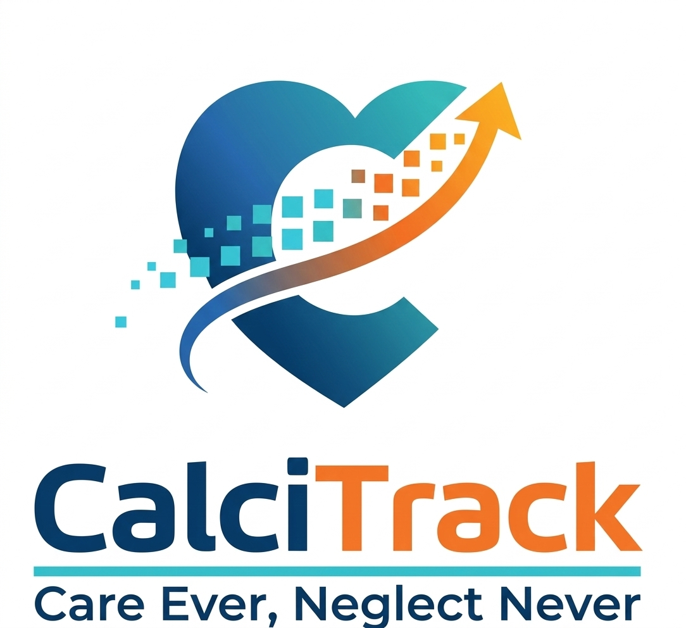

  
  
  

  

 

  
## START EARLY, DRIVE SLOWLY, REACH SAFELY

---

## My Philosophy: Start Early, Drive Slowly, Reach Safely
Heart health is a journey, not a destination. With CalciTrack, I guide patients through this journey to ensure they never have to face an emergency room crisis.

* **Start Early:** Early detection is my first line of defense. I identify risk factors years before they become symptoms.
* **Drive Slowly:** Getting a precise diagnosis is about steady, informed action. I use biomarkers such as $Lp(a)$ and $hs-CRP$ to assess the heart's true condition.
* **Reach Safely:** My goal is a solution. By finding the right path based on today's diagnosis, I ensure patients reach a healthy future safely, avoiding the "detour" of the emergency room.

## The Innovation
**CalciTrack** is a specialized clinical decision-support tool engineered to address the unique, often-hidden cardiovascular risk profiles within South Asian and Indian populations. 

Invented by **Sai Keerthana Cherukuri**, a 4th-year medical student (MS4), this platform bridges the gap between high-complexity clinical data and community-level accessibility. By transitioning preventive care from stationary hospitals to the "doorstep" point-of-service, CalciTrack ensures that geography is no longer a barrier to precision cardiology.

## Core Capabilities
* **South Asian Adjusted Risk Engine:** Re-calibrates standard algorithms to account for the significantly higher baseline Coronary Artery Disease (CAD) risk in Asian Indian phenotypes.
* **Precision Marker Upgrades:** Implements automated reclassification logic using $Lp(a) > 50\text{ mg/dL}$ and $hs-CRP \ge 2.0\text{ mg/L}$ to identify "hidden" high-risk patients.
* **Female-Specific Enhancers:** Integrates critical non-traditional markers, including Preeclampsia, Gestational Diabetes, and PCOS history.
* **Field-Optimized Workflow:** Designed for the frontline with multi-language support and direct-to-specialist WhatsApp referral integration.

[Image of clinical decision support system architecture]

## Project Navigation
* [**Clinical Logic and Algorithm**](CLINICAL_LOGIC.md): A technical deep-dive into risk scoring, localized BMI thresholds, and precision reclassification rules.
* [**Scientific Evidence and Citations**](EVIDENCE.md): The evidence-based foundation, mapping to AHA/ACC guidelines and population-specific medical journals.
* [**Mission and Philosophy**](MISSION.md): Our vision for decentralizing healthcare and the "Doorstep" model of community impact.

##  The Problem
South Asian populations experience premature heart disease 5–10 years earlier than global averages. Because standard risk calculators (like Framingham or SCORE) were developed primarily on Western cohorts, they systematically underestimate risk in South Asians. **CalciTrack applies the necessary "South Asian Lens" to identify risk before symptoms appear.**

---

**Author:** **Sai Keerthana Cherukuri** 
**Role:** MS4 Clinical Innovation Project  
**Motto:** Care Ever, Neglect Never  

---

