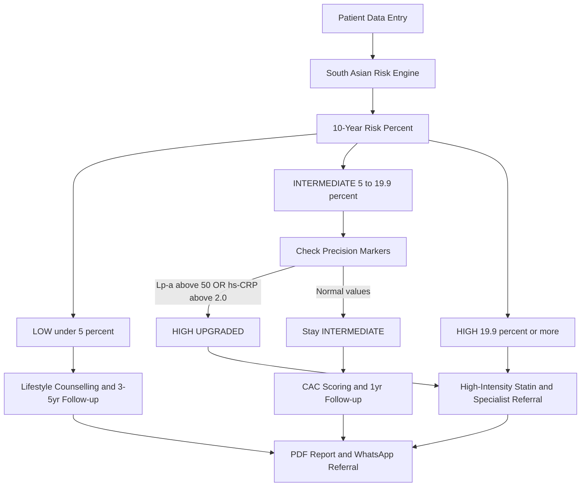
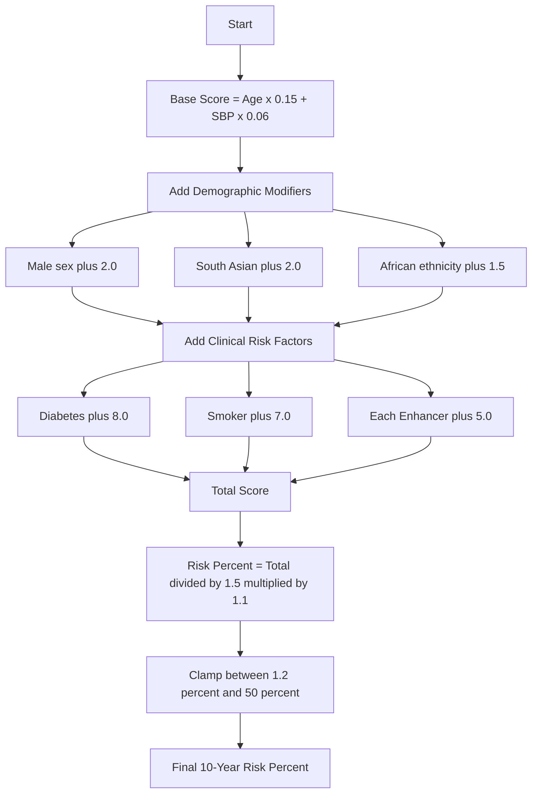
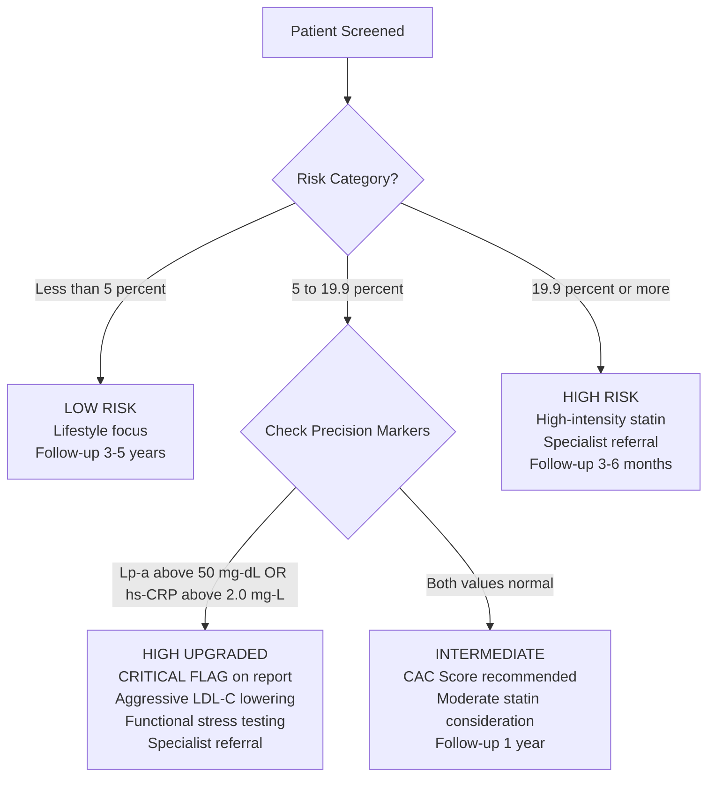
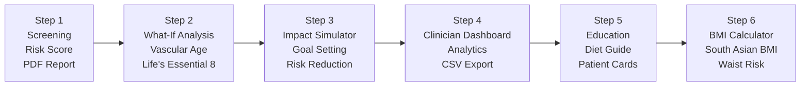
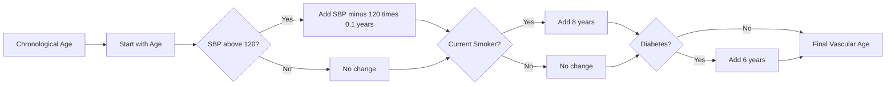

<div align="center">


### Redefining Early Cardiovascular Risk Detection


*Doorstep Cardiac Screening & Specialist Referral — Engineered for South Asian Populations*

[](https://python.org)
[](https://streamlit.io)
[](LICENSE)
[]()
[]()
[]()

<br/>

**Invented by [Sai Keerthana Cherukuri](https://github.com/saikeerthana999)**
MS4 Clinical Innovation Project

*"Cardiovascular disease does not begin with symptoms. It begins with risk."*

</div>

---

## The Problem

> South Asian populations develop coronary artery disease **5–10 years earlier** than Western populations — yet every major risk calculator was built on Western cohorts.

The Framingham Risk Score, SCORE, and ACC/AHA Pooled Cohort Equations **systematically underestimate** cardiovascular risk in South Asians. The result: millions of preventable cardiac events.

**CalciTrack applies the South Asian Lens** — a population-adjusted clinical decision-support system that detects risk precisely, stratifies accurately, and enables early intervention.

---

## Philosophy

| Detect Early | Stratify Precisely | Prevent Effectively |
|:---:|:---:|:---:|
| Identify subclinical cardiovascular risk using population-adjusted scoring and advanced biomarkers — **Lp(a)** and **hs-CRP** | Move beyond generalized calculators. Reclassify risk using **South Asian-specific thresholds** and precision biomarker logic | Translate risk scores into **clear, actionable clinical decisions** — early statin initiation, referrals, and prevention strategies |

---

## System Architecture



---

## Clinical Algorithm

### Risk Score Calculation



### Risk Enhancers — +5.0 each

| Category | Enhancers |
|---|---|
| Female-Specific | Preeclampsia · Gestational Diabetes · Early Menopause · PCOS |
| Genetic / Comorbid | Family CAD · CKD · Metabolic Syndrome |
| Biomarker Checkbox | Elevated Lp(a) · Elevated hs-CRP |

---

## Precision Marker Upgrade — The Decision Tree



### Why These Two Markers?

| Marker | Threshold | Mechanism | Evidence |
|---|:---:|---|---|
| **Lp(a)** Lipoprotein-a | > 50 mg/dL | Genetically determined · Drives plaque and thrombosis · Not reduced by statins | Wilson DP et al., *J Clin Lipidol*, 2022 |
| **hs-CRP** High-Sensitivity CRP | >= 2.0 mg/L | Chronic vascular inflammation · Predicts MI even in low-LDL patients | Ridker PM et al., *NEJM*, 2017 CANTOS |

---

## The South Asian Lens

```mermaid
graph LR
    subgraph Standard ["Standard Calculators"]
        S1[BMI Obese above 30]
        S2[Waist Men above 102 cm]
        S3[Waist Women above 88 cm]
        S4[No ethnicity adjustment]
        S5[No female enhancers]
    end

    subgraph CalciTrack ["CalciTrack South Asian Lens"]
        C1[BMI Obese above 25]
        C2[Waist Men above 90 cm]
        C3[Waist Women above 80 cm]
        C4[South Asian modifier plus 2.0]
        C5[Preeclampsia GDM PCOS Menopause]
    end

    Standard -->|South Asian Lens Applied| CalciTrack
```



---

## 6-Step Clinical Workflow



---

## Vascular Age Calculation



**Example:** Age 45 · SBP 140 · Smoker · Diabetic
→ 45 + (140−120)×0.1 + 8 + 6 = **61 years biological vascular age**

---

## Core Features

| # | Feature | Description |
|---|---|---|
| 1 | Multi-Language | Full UI in English, Hindi, Telugu, Tamil |
| 2 | Visual Risk Gauge | SVG speedometer — real-time colour-coded risk |
| 3 | Life's Essential 8 | AHA interactive health checklist with scoring |
| 4 | South Asian Diet Guide | Food swaps, Indian Heart Plate, spice guide |
| 5 | Patient Education Cards | Lp(a), hs-CRP, Vascular Age, CAC, ASCVD explained simply |
| 6 | Session Analytics | Risk distribution, age group, gender breakdown charts |
| 7 | CSV Export | Download session screening data |
| 8 | Follow-Up Scheduler | Auto next-screening date by risk tier |
| 9 | Evidence Citations | AHA/ACC, CSI, CANTOS, IDF references table |
| 10 | SA BMI Calculator | South Asian thresholds and waist circumference risk |

---

## Quick Start

```bash
git clone https://github.com/saikeerthana999/CalciTrack.git
cd CalciTrack
pip install streamlit pandas fpdf
streamlit run app.py --server.port 5000
```

---

## Project Structure

```
CalciTrack/
├── app.py                   # Main application — all 6 steps + methodology tab
├── translations.py          # Multi-language strings (EN / HI / TE / TA)
├── README.md                # This file
├── CONTRIBUTING.md          # Contributor guidelines
├── CITATION.cff             # Academic citation file
├── LICENSE                  # MIT License
├── .gitignore               # Git ignore rules
├── .streamlit/
│   └── config.toml          # Streamlit server configuration
└── attached_assets/
    └── *.png                # Logo and image assets
```

---

## Evidence Base

| Reference | Year | Relevance in CalciTrack |
|---|:---:|---|
| AHA/ACC Primary Prevention Guidelines | 2019 | Core ASCVD framework · Statin initiation thresholds |
| CSI Consensus Statement — South Asian CVD | 2020 | South Asian CAD risk adjustment · Ethnicity modifier |
| Wilson DP et al., *J Clin Lipidol* | 2022 | Lp(a) >50 mg/dL as independent risk enhancer |
| Ridker PM et al., *NEJM* — CANTOS Trial | 2017 | hs-CRP >=2.0 mg/L · Anti-inflammatory statin benefit |
| IDF Consensus Statement | 2006 | Waist circumference: Men >90cm · Women >80cm |
| WHO Asia-Pacific BMI Guidelines | 2004 | BMI obesity threshold >=25 for South Asians |

---

## Citation

```bibtex
@software{calcitrack2025,
  author    = {Cherukuri, Sai Keerthana},
  title     = {CalciTrack: South Asian-Adjusted Cardiovascular Risk Detection},
  year      = {2025},
  url       = {https://github.com/saikeerthana999/CalciTrack},
  license   = {MIT}
}
```

---

## Contributing

Contributions from clinicians, researchers, and developers are welcome.
Please read [CONTRIBUTING.md](CONTRIBUTING.md) before submitting a pull request.

---

<div align="center">

---

### CalciTrack

*Redefining Early Cardiovascular Risk Detection*

**Invented by Sai Keerthana Cherukuri · MS4 Clinical Innovation Project**

[](https://github.com/saikeerthana999)
[](LICENSE)

*Detect Early · Stratify Precisely · Prevent Effectively*

---

</div>
