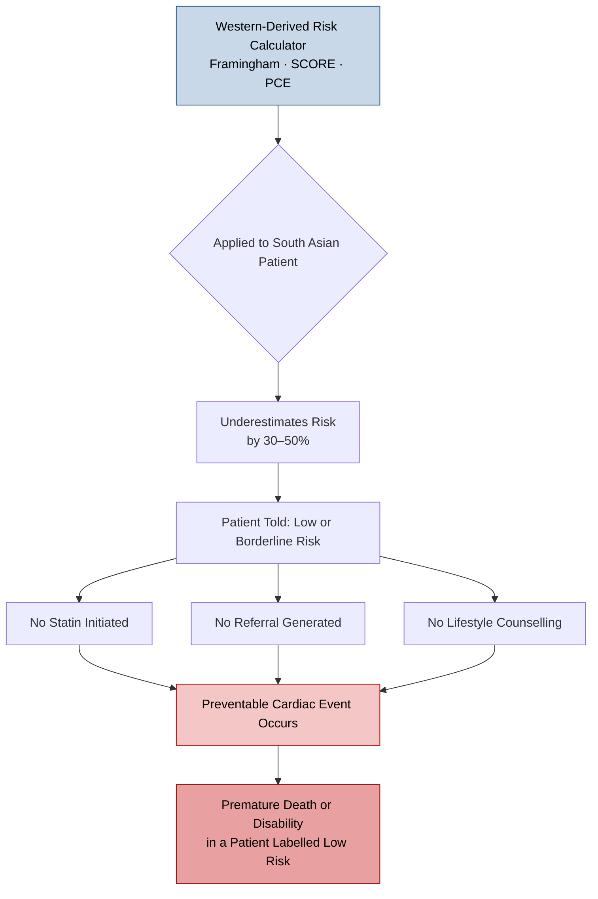
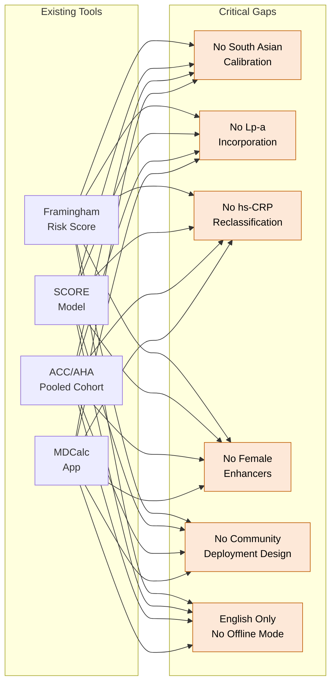
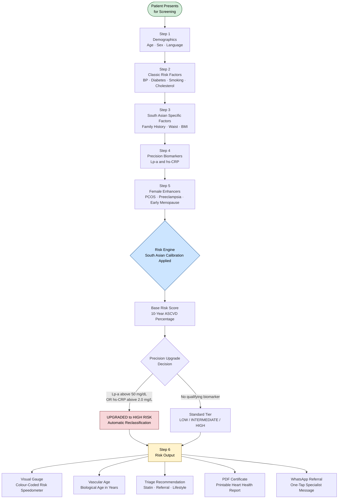
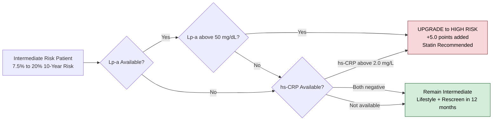
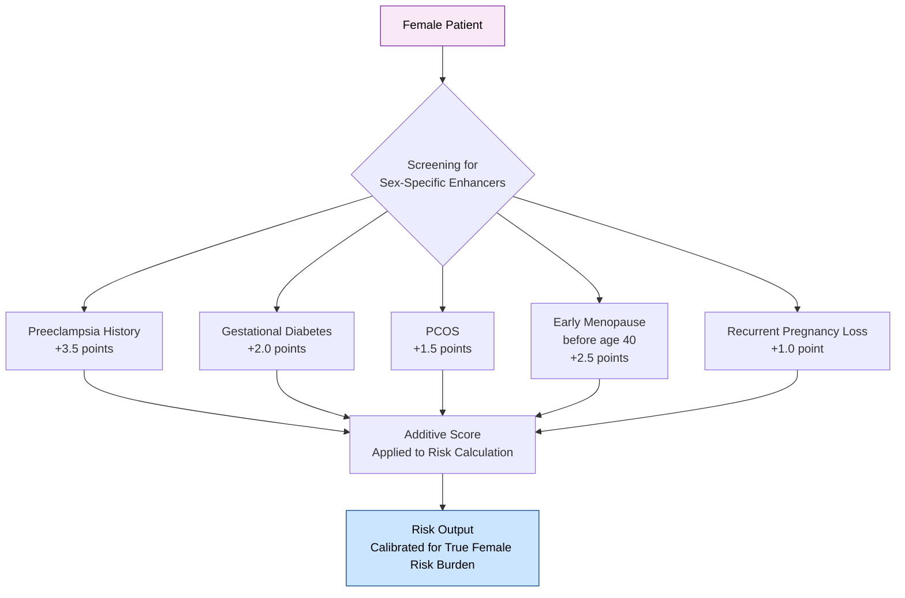
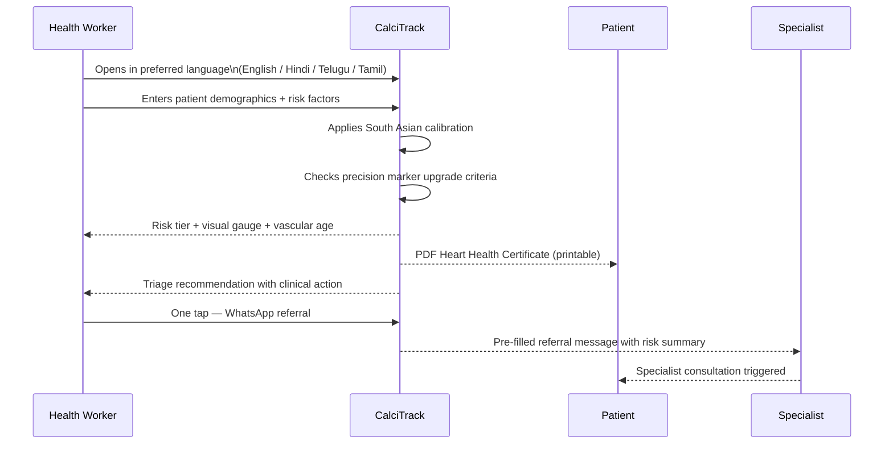
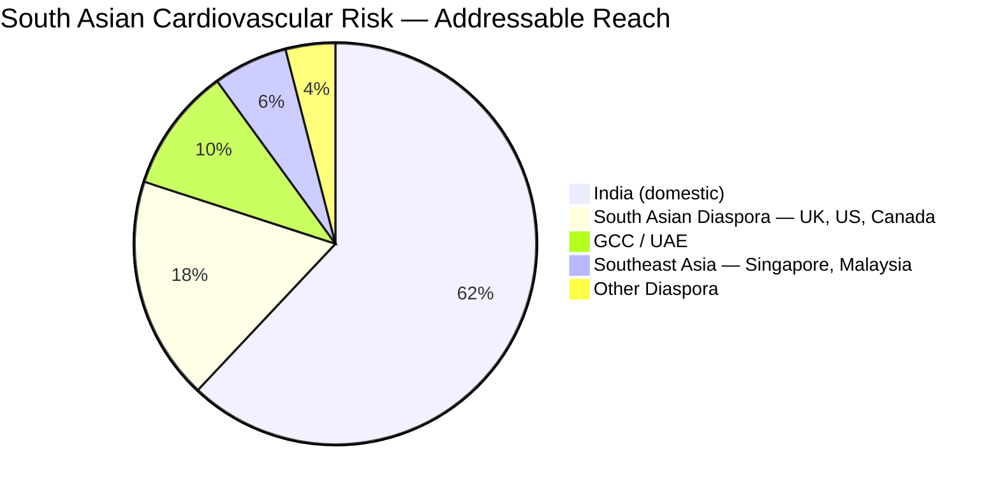
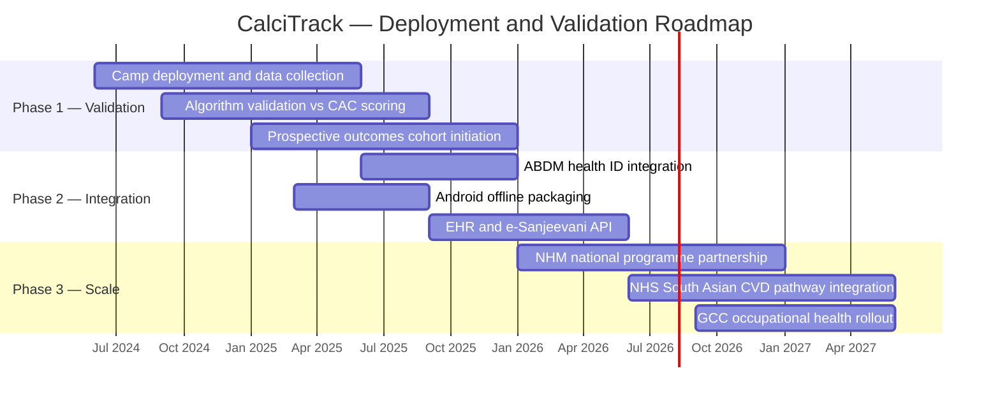
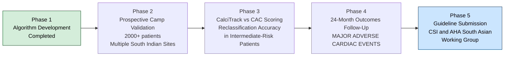

# CalciTrack
## Redefining Early Cardiovascular Risk Detection for South Asian Populations

**Inventor:** Sai Keerthana Cherukuri  
**Designation:** Fourth Year Medical Student, Clinical Innovation Project  
**Category:** Digital Health / Preventive Cardiology / Population Medicine  
**Repository:** [github.com/saikeerthana999/CalciTrack](https://github.com/saikeerthana999/CalciTrack)

---

> *"Cardiovascular disease does not begin with symptoms. It begins with risk — and in South Asia, that risk has been measured with the wrong ruler for decades."*

---

## 1. Problem Statement

### The Scale of the Crisis

Cardiovascular disease is the leading cause of premature death across South Asia. India alone records over **2.8 million cardiac deaths annually**. South Asians develop coronary artery disease **five to ten years earlier** than their Western counterparts, present with more severe multivessel disease at first diagnosis, and carry a mortality burden that no existing frontline clinical tool has been calibrated to address.

The tragedy is not a lack of technology. It is the systematic application of the **wrong technology** to the wrong population.

---

### The Measurement Gap

Every validated cardiovascular risk calculator in global clinical use — the Framingham Risk Score, the European SCORE model, and the ACC/AHA Pooled Cohort Equations — was derived from **predominantly White, North American and European populations**. When applied to South Asian patients, these tools underestimate actual cardiovascular risk by a clinically significant margin.

---

### Two Markers That Change Everything — and Are Never Measured

Two biomarkers with the strongest evidence base for cardiovascular reclassification are **absent from every standard screening tool**:

| Biomarker | Why It Matters | Why It Is Missed |
|---|---|---|
| **Lipoprotein(a) — Lp(a)** | Genetically determined; disproportionately elevated in South Asians; causally linked to atherosclerosis; cannot be reduced by statins or diet | No standard calculator incorporates it |
| **High-sensitivity CRP — hs-CRP** | Marker of vascular inflammation; established causal pathway to cardiac events (CANTOS Trial, 2017); independent predictor of MACE | Excluded from all frontline triage tools |

These are not niche markers. They are **the two most evidence-supported reclassification variables** in contemporary preventive cardiology — and they are invisible at the point of care.

---

### The Structural Delivery Failure

Beyond the algorithmic gap lies a delivery gap. Preventive cardiology remains concentrated in tertiary centres inaccessible to the majority of India's population. Community health workers, primary care physicians, and camp-based screening programmes have no validated, population-specific tool to enable accurate triage at the doorstep.

The patients at highest risk — South Asian individuals aged 35–55, with unrecognised metabolic risk factors, without access to specialist care — are being told they are safe by tools that were never built to evaluate them.

---

## 2. Prior Art and Novelty

### What Exists — and Where It Fails

---

### Where CalciTrack Stands Apart

CalciTrack is the **first point-of-care cardiovascular risk tool designed specifically and comprehensively for South Asian populations**. Its novelty rests on five compounding innovations — no existing tool combines more than one.

| Feature | Framingham | SCORE | ACC/AHA PCE | MDCalc | **CalciTrack** |
|---|:---:|:---:|:---:|:---:|:---:|
| South Asian population adjustment | No | No | No | No | **Yes** |
| Lp(a) reclassification | No | No | No | No | **Yes** |
| hs-CRP precision upgrade | No | No | No | No | **Yes** |
| Female-specific enhancers | No | No | Partial | No | **Yes** |
| Multilingual (4 languages) | No | No | No | No | **Yes** |
| Offline / doorstep deployment | No | No | No | No | **Yes** |
| PDF report + referral messaging | No | No | No | No | **Yes** |
| Vascular age communication | No | No | No | No | **Yes** |

---

### Evidence Foundation

All clinical logic in CalciTrack is derived directly from peer-reviewed guidelines and landmark trials:

- **AHA/ACC 2019** — Primary Prevention of Cardiovascular Disease: Risk Enhancers and Precision Medicine
- **Cardiological Society of India 2020** — Consensus on Cardiovascular Risk in South Asians
- **CANTOS Trial (Ridker et al., NEJM 2017)** — hs-CRP and targeted anti-inflammatory therapy for MACE prevention
- **INTERHEART Study (Yusuf et al., Lancet 2004)** — Nine modifiable risk factors accounting for 90% of PAR in South Asians
- **IDF / WHO Asia-Pacific Guidelines** — South Asian–specific BMI and waist circumference thresholds
- **MESA Study** — Lp(a) as independent predictor of cardiovascular events across ethnic groups

---

## 3. The Solution

### Clinical Algorithm Overview

---

### The Precision Marker Upgrade — Why This Changes Outcomes

The most clinically significant innovation in CalciTrack is the **two-level biomarker reclassification system**. When a patient enters the intermediate risk zone, the clinical decision is not complete. It requires an answer to one question: *what does the biology say beneath the surface?*

This rule operationalises the AHA/ACC 2019 guidance on risk enhancers for statin initiation decisions — placing a complex specialist-level clinical judgement into a tool that works in a community camp with a frontline health worker.

---

### Female-Specific Risk Quantification

CalciTrack is the first triage tool to numerically incorporate **sex-specific cardiovascular risk enhancers** that are chronically underweighted in standard practice:

These are not soft flags. They are weighted, additive scoring inputs grounded in AHA/ACC 2019 evidence — applied systematically for the first time in a frontline screening workflow.

---

### The User Experience — Designed for the Point of Care

The application operates as a **7-step guided workflow** completing in under two minutes, producing an output readable by a community health worker and actionable by a primary care physician.

---

## 4. Market Analysis and IP

### Addressable Population

| Segment | Estimated Size | Primary Entry Point |
|---|---|---|
| India frontline health workers (ASHA/ANM) | 1,000,000+ | NHM Community Screening Programmes |
| India registered physicians (MBBS) | 1,200,000+ | CME integration and professional licensing |
| South Asian diaspora clinics (UK, US, Canada) | 30,000,000+ patients | NHS South Asian CVD pathways; diaspora community health |
| Corporate occupational health (GCC/UAE) | 8,000,000+ workers | Mandatory cardiac screening camps |
| Academic medical institutions | 700+ medical colleges | Clinical training and simulation |

---

### Intellectual Property Position

CalciTrack's core IP resides in three original clinical design elements:

1. **The South Asian risk calibration algorithm** — a population-adjusted weighted scoring model correcting for documented underestimation in Western-derived calculators, grounded in CSI 2020 and INTERHEART evidence
2. **The precision marker reclassification rule** — the specific decision logic converting Lp(a) and hs-CRP thresholds into automatic risk tier upgrades with statin initiation triggers
3. **The female-specific cardiovascular enhancer quantification framework** — the first numerically weighted integration of obstetric and gynaecological history into a frontline cardiac triage score

The codebase is published open-source (MIT licence) to accelerate academic validation and community adoption, with a structured pathway to commercial licensing as institutional and public health partnerships are established. A `CITATION.cff` file ensures all academic use is properly attributed to the inventor.

---

## 5. Scaling, Roadmap, and Business Proposition

### Three-Phase Deployment Roadmap

---

### Business Model

| Revenue Stream | Description | Target Customer |
|---|---|---|
| Institutional dashboard licence | Clinical analytics for camp coordinators, hospital groups, and public health agencies | District hospitals, corporate health |
| EHR / telemedicine integration | API licensing for platforms embedding CalciTrack risk engine | HealthTech partners |
| Population analytics contracts | De-identified, aggregate cardiovascular risk data | State health agencies, insurers |
| Training and certification | CME-accredited modules for health workers using CalciTrack | Medical colleges, NHM |

The **core screening tool remains permanently free** — ensuring that the community health worker at a doorstep camp in rural Andhra Pradesh has the same clinical capability as a preventive cardiologist in a private hospital in Chennai.

---

### Economic Case for Prevention

The cost per MACE event in India is estimated at **INR 3–8 lakh** for acute hospital management alone, excluding rehabilitation, lost productivity, and downstream chronic disease management. CalciTrack-enabled triage identifies patients who require statin therapy and specialist review **before** that event occurs.

At a marginal screening cost of under **INR 50 per patient** at camp scale, the economic return on accurate early triage is not an argument — it is arithmetic.

---

## 6. Critical Evaluation

### Honest Assessment of Strengths

CalciTrack addresses a real, documented, and consequential clinical gap — not a theoretical one. Its clinical foundation is derived from peer-reviewed guidelines and landmark trials. Its design decisions — the population calibration, the biomarker reclassification, the female enhancers, the multilingual offline architecture — are each grounded in specific evidence identifying specific failures of existing tools.

The problem it solves is not a niche academic problem. It is a mass-scale public health failure occurring daily across the most cardiovascular-vulnerable population on earth.

---

### Limitations — Stated Without Qualification

**Algorithmic validation status:** The current risk engine is a calibrated weighted model rather than a prospectively validated regression derived from a longitudinal South Asian cardiovascular outcomes dataset. This is the essential next step. Without prospective validation against hard endpoints (MACE — myocardial infarction, stroke, cardiovascular death), clinical guideline endorsement cannot be claimed.

**Data input dependency:** The tool requires manual or clinician-entered data. In the absence of point-of-care integration with automated blood pressure devices or bedside biomarker testing, input quality depends on the data available. This is a Phase 2 engineering priority.

**Female enhancer weighting:** The specific numerical weights applied to obstetric and gynaecological risk factors represent evidence-informed clinical design rather than empirically derived regression coefficients. Refinement through prospective data is required.

---

### Validation Roadmap

A prospective validation protocol is being designed in collaboration with cardiology departments at teaching hospitals across South India, targeting 2,000+ patients with a 24-month follow-up period for major adverse cardiac events. Interim validation will compare CalciTrack risk stratification against coronary artery calcium scoring — the gold standard reclassification benchmark in the AHA/ACC guidelines.

---

### The Stakes — A Final Argument

A 47-year-old South Asian woman presents for a health camp. She has PCOS, a history of preeclampsia, and a mildly elevated Lp(a) measured by her general practitioner six months ago. Every existing risk calculator tells her she is at borderline risk. She receives no statin. She receives no referral. She leaves the camp reassured.

Eighteen months later, she has a myocardial infarction.

CalciTrack would have stratified her as HIGH RISK — upgraded by Lp(a) and her obstetric history — and generated a referral before that event.

That is not a hypothetical patient. That is the patient this tool was built for.

---

## References

1. Goff DC Jr, et al. 2013 ACC/AHA Guideline on the Assessment of Cardiovascular Risk. *JACC.* 2014;63(25 Pt B):2935–59.
2. Arnett DK, et al. 2019 ACC/AHA Guideline on the Primary Prevention of Cardiovascular Disease. *Circulation.* 2019;140(11):e596–646.
3. Ridker PM, et al. Antiinflammatory Therapy with Canakinumab for Atherosclerotic Disease. *NEJM.* 2017;377:1119–31.
4. Yusuf S, et al. Effect of potentially modifiable risk factors associated with MI in 52 countries. *Lancet.* 2004;364(9438):937–52.
5. Cardiological Society of India. CSI Consensus Statement on Lipid Management 2020. *Indian Heart J.* 2020.
6. Nordestgaard BG, et al. Lipoprotein(a) as a cardiovascular risk factor: current status. *Eur Heart J.* 2010;31(23):2844–53.
7. IDF / WHO Asia-Pacific. Appropriate body-mass index for Asian populations. *Lancet.* 2004;363(9403):157–63.

---

*CalciTrack — Invented by Sai Keerthana Cherukuri, MS4 Clinical Innovation Project*  
*github.com/saikeerthana999/CalciTrack*
