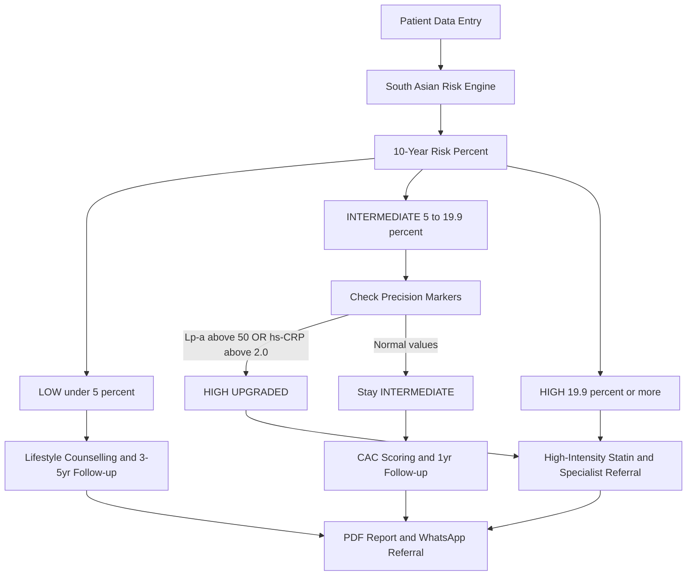

# How CalciTrack Works — The Big Picture

*A plain-English guide to the CalciTrack system for clinicians, evaluators, and non-technical readers*

---

## The Diagram

---

## What This Diagram Shows

This is the **complete journey of a single patient through CalciTrack** — from the moment data is entered to the moment a clinical recommendation is delivered.

Think of it as a smart triage system. You put in a patient's basic information, and the tool guides you — step by step — to the right clinical action.

---

## Step-by-Step Plain English Walkthrough

### Step 1 — Data Goes In
A health worker or clinician enters the patient's basic details: age, blood pressure, whether they smoke, whether they have diabetes, family history, and any available blood test results. This takes less than two minutes.

### Step 2 — The South Asian Risk Engine Runs
This is the heart of CalciTrack. Unlike standard calculators, this engine has been **calibrated specifically for South Asian patients**. It knows that a 45-year-old South Asian man with borderline blood pressure carries significantly more risk than the same profile in a Western patient. It adds the appropriate adjustments before calculating the score.

### Step 3 — A Risk Percentage is Produced
The engine calculates a **10-year cardiovascular risk percentage** — the probability of a patient having a heart attack or stroke in the next 10 years if nothing changes.

### Step 4 — The Patient is Sorted into a Risk Tier

| What the score says | What it means |
|---|---|
| Under 5% | **LOW** — The patient is at low risk. Focus on lifestyle. |
| 5% to 19.9% | **INTERMEDIATE** — Not clearly safe, not clearly dangerous. Needs more investigation. |
| 19.9% and above | **HIGH** — The patient needs immediate clinical action. |

### Step 5 — The Intermediate Problem is Solved
The most clinically difficult patients are the INTERMEDIATE ones. They are too risky to ignore, but not risky enough to automatically start on medication. This is where CalciTrack does something standard tools cannot:

It checks two precision biomarkers — **Lp(a)** and **hs-CRP** — that reveal hidden risk that a basic risk score cannot see.

- If either value is elevated → The patient is **upgraded to HIGH**
- If both are normal → The patient stays at **INTERMEDIATE**

### Step 6 — The Right Recommendation is Delivered
Every patient receives:
- A **clinical recommendation** — what to do and when
- A **follow-up date** — when to rescreen
- A **PDF clinical report** — printable and shareable
- A **WhatsApp referral message** — pre-filled and ready to send to a specialist

---

## Why This Approach?

Standard tools stop at Step 4. They give you a number and leave the clinical interpretation to the clinician. CalciTrack goes further — it interprets that number in the context of the individual patient, flags hidden risk that basic scores miss, and delivers an actionable recommendation.

This is what makes it suitable for **doorstep and community-level screening**, where the health worker may not be a cardiologist but still needs to make the right triage decision.

---

*Part of the CalciTrack Documentation Series — see the [docs folder](../docs/) for all guides*

---

> **CalciTrack** · Invented by Sai Keerthana Cherukuri · MS4 Clinical Innovation Project
> *Detect Early · Stratify Precisely · Prevent Effectively*
