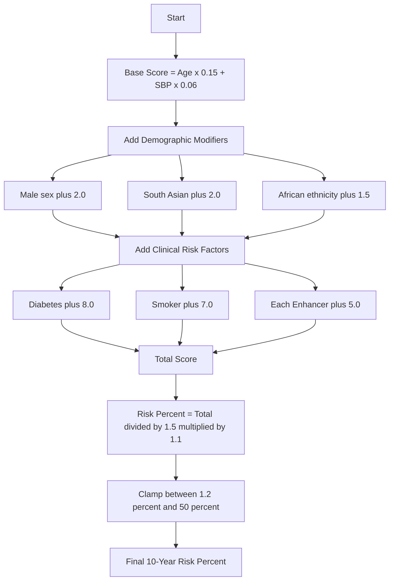

# The Risk Scoring Formula — Explained in Plain English

*How CalciTrack calculates your 10-year cardiovascular risk, and why every number was chosen*

---

## The Diagram



---

## What This Diagram Shows

This is the **mathematical engine inside CalciTrack**. Every number in this formula represents a clinical decision — a deliberate choice based on evidence. This document explains what each part means and why it was built this way.

---

## Building the Formula — Layer by Layer

### Layer 1: The Foundation — Age and Blood Pressure

```
Base Score = (Age × 0.15) + (Systolic BP × 0.06)
```

**Why age?**
Cardiovascular risk increases with every year of life. The heart and blood vessels accumulate damage over time — from inflammation, oxidative stress, and the mechanical wear of every heartbeat. The coefficient 0.15 reflects that each year of age adds a meaningful, measurable unit of risk.

A 60-year-old starts with a base of 9.0 from age alone.
A 30-year-old starts at 4.5 — already half the risk, just from being younger.

**Why systolic blood pressure (SBP)?**
The systolic number — the top number in a BP reading — is the pressure your heart generates with every beat. Over years, elevated pressure damages the inner lining of arteries, creating the conditions for plaque buildup and heart attacks.

The coefficient 0.06 reflects that each additional 10 mmHg of blood pressure adds approximately 0.6 units of risk. So a patient with SBP 160 contributes 9.6 from blood pressure alone. A patient with SBP 120 contributes only 7.2.

**Why not diastolic BP?**
Systolic BP is the stronger, more consistent predictor of cardiovascular events in adults over 40 — supported by decades of Framingham Heart Study data and the 2019 AHA/ACC guidelines.

---

### Layer 2: Demographic Modifiers

These are additions that reflect biological and population-level differences in cardiovascular risk.

| Modifier | Added Points | Why |
|---|:---:|---|
| Male sex | +2.0 | Men develop CAD approximately 7–10 years earlier than women. Oestrogen provides partial cardiovascular protection in premenopausal women. The +2.0 reflects this well-documented gap. |
| South Asian ethnicity | +2.0 | South Asians have a 3–5x higher rate of premature CAD compared to Western populations. Despite lower rates of obesity and smoking in some studies, the rates of insulin resistance, central obesity, and inflammatory markers are significantly higher. This +2.0 is grounded in the CSI 2020 Consensus. |
| African ethnicity | +1.5 | African populations have higher rates of hypertension and hypertensive heart disease, associated with higher baseline cardiovascular risk at the same BP levels. |

**The key insight:** A South Asian male and a European male of the same age, same BP, same lifestyle should NOT receive the same risk score. Their biology and their population history are different. CalciTrack corrects for this.

---

### Layer 3: Major Clinical Risk Factors

| Risk Factor | Added Points | Why |
|---|:---:|---|
| Diabetes | +8.0 | Diabetes is considered a **"CAD risk equivalent"** in international guidelines — meaning a diabetic patient without prior heart disease has the same risk as a non-diabetic patient who has already had a heart attack. The +8.0 reflects this extraordinary risk magnitude. Diabetes damages blood vessels through glycosylation, oxidative stress, and chronic inflammation. |
| Smoking / Tobacco | +7.0 | Smoking is the single most modifiable cardiovascular risk factor. It directly injures the vascular endothelium, accelerates plaque formation, promotes clotting, and reduces HDL cholesterol. The +7.0 reflects approximately a 2–4x increase in relative cardiovascular risk versus non-smokers. |

---

### Layer 4: Risk Enhancers

Each of the following adds **+5.0 points** to the score:

**Female-Specific Enhancers:**

| Enhancer | Why It Matters |
|---|---|
| Preeclampsia history | Women who experienced preeclampsia during pregnancy have 2x the risk of stroke and 4x the risk of hypertension later in life. The placental damage during preeclampsia reflects underlying vascular vulnerability. |
| Gestational Diabetes (GDM) | GDM is a marker of insulin resistance that often persists post-pregnancy. Women with GDM have a 7x higher risk of developing Type 2 diabetes and associated cardiovascular disease. |
| Early Menopause (before 40) | Oestrogen is cardioprotective. Early menopause removes this protection decades sooner than expected, exposing the cardiovascular system to accelerated ageing. |
| PCOS | Polycystic Ovary Syndrome is associated with insulin resistance, central obesity, dyslipidaemia, and chronic inflammation — all independent cardiovascular risk factors. |

**General Enhancers:**

| Enhancer | Why It Matters |
|---|---|
| Family history of premature CAD | A first-degree relative with CAD before age 55 (male) or 65 (female) suggests a shared genetic vulnerability — whether in lipid metabolism, inflammatory pathways, or vascular biology. |
| Chronic Kidney Disease (CKD) | The kidney and heart are physiologically linked. CKD accelerates vascular calcification, promotes anaemia (which stresses the heart), and triggers the renin-angiotensin system — creating a cycle of rising BP and cardiac damage. |
| Metabolic Syndrome | A cluster of central obesity, elevated triglycerides, low HDL, high blood pressure, and elevated fasting glucose. Having three or more of these criteria more than doubles cardiovascular event risk. |

---

### Layer 5: Converting the Score to a Risk Percentage

```
Risk % = clamp( (Total Score ÷ 1.5) × 1.1,  minimum 1.2%,  maximum 50% )
```

**Why divide by 1.5?**
The total score is a weighted sum of risk units — not a percentage. The divisor 1.5 is a calibration constant that converts the raw score into a percentage range that aligns with published 10-year ASCVD risk data from the ACC/AHA Pooled Cohort Equations.

**Why multiply by 1.1?**
The 10% upward adjustment accounts for the systematic underestimation of risk in South Asian populations that has been documented when standard Western calculators are applied. This correction factor aligns CalciTrack's output with observed event rates in South Asian cohort studies.

**Why clamp at 1.2% and 50%?**
- **Minimum 1.2%:** No living adult has zero cardiovascular risk. Even the healthiest young person has a non-zero probability of a cardiac event. 1.2% represents the floor of biological risk.
- **Maximum 50%:** Clinical risk calculators are not designed to project above 50% 10-year risk. Beyond this threshold, the clinical action is the same regardless of the exact number — immediate intervention. Reporting a number above 50% adds no clinical utility.

---

## A Worked Example

**Patient:** 48-year-old South Asian woman, SBP 138 mmHg, smoker, has PCOS, has gestational diabetes history

| Component | Calculation | Points |
|---|---|:---:|
| Age | 48 × 0.15 | 7.2 |
| SBP | 138 × 0.06 | 8.28 |
| South Asian | Fixed modifier | +2.0 |
| Smoker | Fixed modifier | +7.0 |
| PCOS | Enhancer | +5.0 |
| GDM | Enhancer | +5.0 |
| **Total Score** | | **34.48** |
| **Risk %** | (34.48 ÷ 1.5) × 1.1 | **~25.3%** |
| **Category** | ≥ 19.9% | **HIGH RISK** |

This patient would be flagged as HIGH RISK and recommended for high-intensity statin therapy and specialist referral — a result that a standard Western calculator might miss entirely.

---

*Part of the CalciTrack Documentation Series — see the [docs folder](../docs/) for all guides*

---

> **CalciTrack** · Invented by Sai Keerthana Cherukuri · MS4 Clinical Innovation Project
> *Detect Early · Stratify Precisely · Prevent Effectively*
