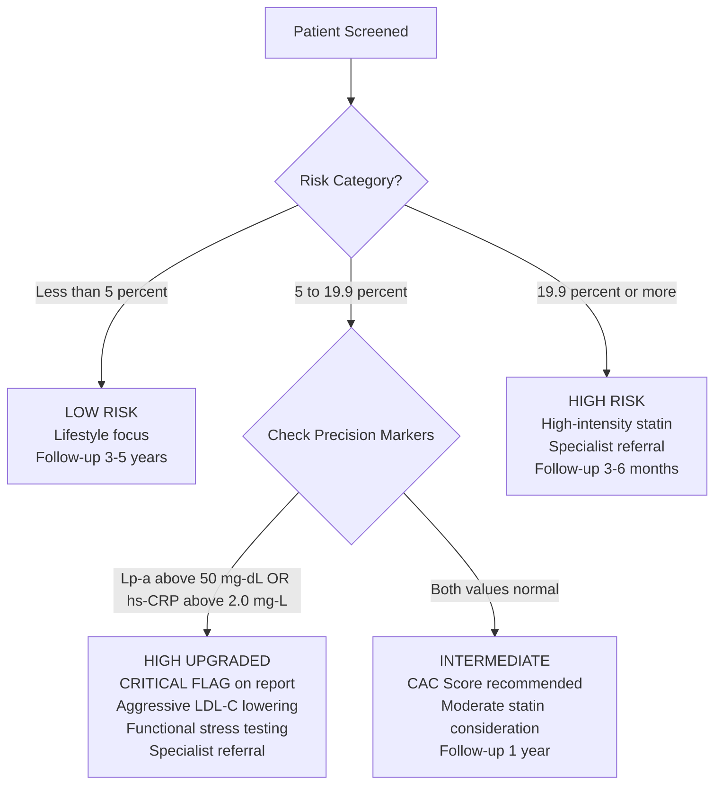

# The Precision Upgrade Decision Tree — Explained in Plain English

*How Lp(a) and hs-CRP catch the patients that a basic risk score would miss*

---

## The Diagram

---

## What This Diagram Shows

This is the **most clinically important decision in cardiovascular triage** — and it is where CalciTrack does something no standard risk calculator does.

The diagram shows how CalciTrack handles the hardest group of patients: those who score in the **Intermediate zone** (5% to 19.9% 10-year risk). These patients are too risky to simply reassure and send home, but not risky enough to automatically put on high-intensity treatment.

The solution: **check two specific blood tests** that reveal whether hidden, dangerous risk is lurking beneath the surface.

---

## The Three Paths — In Plain English

### Path 1: LOW RISK (below 5%)
The patient's risk score is low. Their 10-year probability of a heart attack or stroke is less than 1 in 20.

**What happens:**
- Focus on lifestyle: diet, exercise, not smoking, sleep
- No medication needed at this stage
- Rescreen in 3–5 years
- Use the Life's Essential 8 checklist to identify modifiable habits

**The clinical message:** "Your heart is currently healthy. Let's keep it that way."

---

### Path 2: HIGH RISK (19.9% or above)
The patient's risk score is clearly elevated. Their 10-year probability of a cardiovascular event is nearly 1 in 5 or higher. No further testing needed — the clinical decision is clear.

**What happens:**
- Start high-intensity statin therapy (e.g., Rosuvastatin 20–40mg or Atorvastatin 40–80mg)
- Refer to cardiologist or specialist
- Consider additional investigations (stress test, echocardiogram)
- Rescreen in 3–6 months to assess treatment response

**The clinical message:** "Your heart is at serious risk. We need to act now."

---

### Path 3: INTERMEDIATE — The Difficult Middle (5% to 19.9%)

This is where most clinical uncertainty lives. The patient is not clearly safe. The patient is not clearly in danger. Standard calculators stop here and leave the decision to the clinician's instinct.

**CalciTrack does not stop here.**

It asks two questions:

#### Question 1: Is Lp(a) above 50 mg/dL?

**What is Lp(a)?**
Lipoprotein(a) — pronounced "L-P-little-a" — is a particle in the blood that carries cholesterol. Unlike LDL cholesterol, which can be reduced by diet and statins, **Lp(a) is almost entirely determined by your genes**. You are born with your Lp(a) level, and it stays roughly constant throughout your life.

**Why does it matter?**
Lp(a) has two dangerous properties:
1. It promotes the build-up of fatty plaques inside arteries (atherosclerosis)
2. It promotes blood clotting — making those plaques more likely to rupture and cause a heart attack

**Why the threshold of 50 mg/dL?**
The 2022 consensus paper by Wilson DP et al. in the Journal of Clinical Lipidology established that Lp(a) above 50 mg/dL independently predicts atherosclerotic events — meaning even after accounting for all other risk factors, an elevated Lp(a) adds its own significant risk on top.

**Why is this especially important for South Asians?**
Studies show that South Asian populations have higher rates of elevated Lp(a) compared to European populations — and this elevation is frequently undetected because standard risk assessments do not include it.

---

#### Question 2: Is hs-CRP at or above 2.0 mg/L?

**What is hs-CRP?**
High-sensitivity C-reactive protein is a protein produced by the liver in response to **inflammation** in the body. The "high-sensitivity" version of this test can detect very small amounts of chronic, low-grade inflammation — the kind that smoulders silently inside blood vessel walls without causing obvious symptoms.

**Why does it matter?**
When the inner lining of an artery (the endothelium) is inflamed, it becomes sticky and fragile. Cholesterol particles embed more easily. Plaques grow faster. Blood clots form more readily. Chronic vascular inflammation is now understood to be a **direct cause** — not just a marker — of heart attacks and strokes.

**Why the threshold of 2.0 mg/L?**
The landmark CANTOS trial (Ridker PM et al., New England Journal of Medicine, 2017) showed that:
- Patients with hs-CRP ≥ 2.0 mg/L had significantly elevated cardiovascular event rates
- Reducing inflammation — even without changing cholesterol — reduced those events
- This established 2.0 mg/L as the clinically meaningful threshold

---

### The Upgrade Decision

If **either** Lp(a) is above 50 **OR** hs-CRP is at or above 2.0:

The patient is **upgraded from INTERMEDIATE to HIGH (UPGRADED)**.

This means:
- The PDF clinical report is flagged with a **CRITICAL** warning
- The actual Lp(a) and hs-CRP values are printed on the report
- The recommendation changes to high-intensity statin + aggressive LDL lowering + specialist referral + possible functional stress testing

**The clinical message:** "Your basic risk score looked moderate. But your blood tests reveal hidden danger. We need to treat you as high risk."

---

## Why This Matters

Consider this scenario:

A 52-year-old South Asian man. Non-smoker. Normal blood pressure. No diabetes. Basic risk score: 14% — squarely INTERMEDIATE.

Standard tool: "Come back in a year."
CalciTrack: checks his Lp(a) — it's 78 mg/dL (genetically elevated, completely invisible to a standard screening).

CalciTrack upgrades him to HIGH (UPGRADED). He starts statin therapy. A potential heart attack — prevented.

**This is the patient standard tools miss. CalciTrack finds him.**

---

*Part of the CalciTrack Documentation Series — see the [docs folder](../docs/) for all guides*

---

> **CalciTrack** · Invented by Sai Keerthana Cherukuri · MS4 Clinical Innovation Project
> *Detect Early · Stratify Precisely · Prevent Effectively*
