# The South Asian Lens — Why Standard Calculators Get It Wrong

*Understanding why CalciTrack uses different thresholds for South Asian patients*

---

## The Diagram

```mermaid
graph LR
    subgraph Standard ["Standard Calculators"]
        S1[BMI Obese above 30]
        S2[Waist Men above 102 cm]
        S3[Waist Women above 88 cm]
        S4[No ethnicity adjustment]
        S5[No female enhancers]
    end

    subgraph CalciTrack ["CalciTrack South Asian Lens"]
        C1[BMI Obese above 25]
        C2[Waist Men above 90 cm]
        C3[Waist Women above 80 cm]
        C4[South Asian modifier plus 2.0]
        C5[Preeclampsia GDM PCOS Menopause]
    end

    Standard -->|South Asian Lens Applied| CalciTrack
```

---

## What This Diagram Shows

This diagram compares **how standard cardiovascular tools see a South Asian patient** versus **how CalciTrack sees them**. The left side shows what every standard calculator does. The right side shows what CalciTrack corrects.

Each correction is not an opinion — it is backed by peer-reviewed evidence and international guidelines.

---

## The Core Problem: Built for the Wrong Population

Every major cardiovascular risk calculator currently in clinical use was developed using data from **predominantly White, European, or North American populations**:

- The **Framingham Risk Score** — derived from a study in Framingham, Massachusetts, starting in 1948
- The **ACC/AHA Pooled Cohort Equations** — based on multiple large US cohort studies, with limited South Asian representation
- The **SCORE model** — developed from European population data

When you apply a tool built for one population to a different population, you introduce **systematic error**. In South Asians, this error consistently causes **underestimation of risk** — meaning patients who should be treated are told they are safe.

---

## Correction 1: The BMI Thresholds

### What standard tools say
- **Overweight:** BMI ≥ 25 kg/m²
- **Obese:** BMI ≥ 30 kg/m²

### What CalciTrack uses
- **Overweight:** BMI ≥ 23 kg/m²
- **Obese:** BMI ≥ 25 kg/m²

### Why?

South Asians develop obesity-related health problems — insulin resistance, Type 2 diabetes, high blood pressure, dyslipidaemia — at **lower body weights** than European populations.

A South Asian man with a BMI of 26 might be told by a standard tool: "You're just slightly overweight — not a concern." But at BMI 26, he may already have the metabolic profile of a European man with BMI 34.

The reason is body composition. South Asians carry more **visceral fat** (fat around internal organs) and less muscle mass at the same BMI compared to Europeans. Visceral fat is metabolically active — it secretes inflammatory molecules and drives insulin resistance far more aggressively than subcutaneous fat (fat under the skin).

**Reference:** WHO Expert Consultation, *Lancet* 2004 — "Appropriate body-mass index for Asian populations"

---

## Correction 2: Waist Circumference Thresholds

### What standard tools say
- **Men at risk:** waist > 102 cm
- **Women at risk:** waist > 88 cm

### What CalciTrack uses
- **Men at risk:** waist > 90 cm
- **Women at risk:** waist > 80 cm

### Why?

Waist circumference is a better indicator of **central (abdominal) obesity** than BMI alone. Central obesity is where the cardiovascular risk lives — the fat packed around the liver, kidneys, and intestines that drives insulin resistance and inflammation.

South Asians accumulate dangerous amounts of central fat at smaller waist sizes. A South Asian man with a 95 cm waist would be told by a standard tool: "You're within the safe zone." CalciTrack correctly flags him as at elevated metabolic risk.

**Reference:** International Diabetes Federation Consensus Statement, 2006 — established separate South Asian waist circumference criteria

---

## Correction 3: The Ethnicity Modifier (+2.0)

CalciTrack adds **+2.0 points** to the risk score for South Asian patients automatically.

This is not a generalisation — it is a calibration. The Cardiological Society of India's 2020 Consensus Statement documented that South Asian populations:
- Develop CAD **5–10 years earlier** than Western populations
- Have higher rates of triple-vessel disease at first presentation
- Have worse outcomes after acute myocardial infarction at younger ages
- Show insulin resistance at lower BMI and smaller waist sizes

The +2.0 modifier is a mathematical representation of this documented population difference. It ensures that a South Asian patient's risk is not invisibly underestimated just because a standard formula didn't account for them.

---

## Correction 4: Female-Specific Cardiovascular Risk Enhancers

Standard risk calculators — with few exceptions — treat women as "men with hormones." The reality of female cardiovascular physiology is far more complex.

CalciTrack incorporates **four female-specific risk enhancers**, each adding +5.0 points to the risk score:

### Preeclampsia
Preeclampsia — high blood pressure during pregnancy — is not just a pregnancy complication. It is a **window into vascular health**. Women who experience preeclampsia have:
- 2× the long-term risk of stroke
- 4× the risk of hypertension
- Higher rates of coronary artery disease in the decades following pregnancy

The blood vessels of a woman who had preeclampsia show subtle damage that is invisible on standard tests but real in terms of future cardiac events.

### Gestational Diabetes (GDM)
Women who develop diabetes during pregnancy are revealing that their insulin-producing cells are under stress. After the pregnancy, that stress often continues. Women with GDM history have:
- 7× the risk of developing Type 2 diabetes
- Significantly elevated long-term cardiovascular risk

### Early Menopause (before age 40)
Oestrogen is cardioprotective. It maintains the elasticity of blood vessel walls, raises HDL (good) cholesterol, and suppresses inflammatory pathways. When menopause arrives early — before age 40 — women lose this protection decades ahead of their peers. Their cardiovascular system effectively ages faster.

### PCOS — Polycystic Ovary Syndrome
PCOS is not simply a reproductive condition. It is a systemic metabolic disorder associated with:
- Insulin resistance in up to 70% of affected women
- Central obesity
- Dyslipidaemia (low HDL, high triglycerides)
- Chronic, low-grade inflammation
- Higher rates of hypertension

Each of these independently elevates cardiovascular risk.

---

## The Net Effect: Finding the Patients Who Fall Through the Cracks

Here is what the South Asian Lens correction means in practice:

**Without CalciTrack:**
A 46-year-old South Asian woman, BMI 24, waist 83 cm, no smoking, no diabetes, has PCOS. Her Framingham score: approximately 4% — LOW RISK. She is sent home and told to return in 5 years.

**With CalciTrack:**
Same patient. BMI 24 → classified as Overweight (South Asian threshold). Waist 83 cm → above the South Asian threshold. PCOS → +5.0 enhancer. South Asian ethnicity → +2.0. Her CalciTrack score: approximately 9% — INTERMEDIATE. She is investigated further, her Lp(a) is checked, and appropriate monitoring begins.

**The difference:** One tool missed her. The other found her.

---

*Part of the CalciTrack Documentation Series — see the [docs folder](../docs/) for all guides*

---

> **CalciTrack** · Invented by Sai Keerthana Cherukuri · MS4 Clinical Innovation Project
> *Detect Early · Stratify Precisely · Prevent Effectively*
