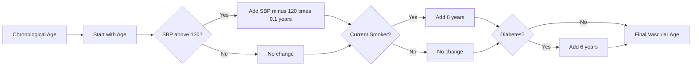

# Vascular Age — Explained in Plain English

*Why your heart may be biologically older than your birthday says — and how CalciTrack calculates it*

---

## The Diagram



---

## What This Diagram Shows

This diagram shows how CalciTrack calculates **Vascular Age** — the biological age of a patient's cardiovascular system, which is often very different from their actual age.

The flow moves left to right: you start with the patient's real age, then add years for each risk factor that has been silently ageing their blood vessels.

---

## What Is Vascular Age?

Your **chronological age** is how old you are in years since you were born.

Your **vascular age** is how old your arteries are — how much wear, damage, and stiffening they have accumulated compared to a healthy reference standard.

These two numbers can be wildly different.

A 45-year-old who smokes, has uncontrolled blood pressure, and has diabetes may have the arteries of a 65-year-old. Their vessels have been battered by decades of high-pressure blood flow, toxic chemicals from tobacco, and the corrosive effects of excess blood sugar. They look 45. Their heart is 65.

Conversely, a 60-year-old who has never smoked, exercises regularly, and has perfect blood pressure may have the arteries of a 50-year-old. Age is on their birth certificate. Health is in their vessels.

**Vascular Age communicates this reality in a way a risk percentage cannot.** Telling a patient "your 10-year risk is 18%" is abstract. Telling them "your heart is biologically 14 years older than you" is immediate, personal, and motivating.

---

## The Formula — Step by Step

### Step 1: Start with Chronological Age

```
Vascular Age = Patient's Age
```

This is the baseline. We begin where the patient is.

### Step 2: Blood Pressure Penalty

```
If SBP > 120 mmHg:  add (SBP − 120) × 0.1 years
```

**Why 120 mmHg as the reference?**
Blood pressure of 120/80 mmHg is considered optimal — the point at which blood pressure causes the least mechanical stress on arterial walls. Any sustained pressure above this level causes progressive damage.

**Why the 0.1 coefficient?**
Every 10 mmHg above 120 mmHg corresponds to roughly 1 additional year of cardiovascular ageing. This relationship is derived from longitudinal blood pressure and cardiovascular outcome studies.

**In plain English:** A patient with SBP 150 has 30 mmHg above the reference point. 30 × 0.1 = **3 extra years** added to their vascular age. Their blood vessels are 3 years older than their birthdate suggests.

A patient with SBP 180 — which is stage 2 hypertension — would add 6 years from blood pressure alone. Over decades, this compounds into severe arterial stiffness, increased risk of aortic events, heart failure, and stroke.

---

### Step 3: Smoking Penalty

```
If current smoker:  add 8 years
```

**Why 8 years?**
Tobacco smoke contains over 7,000 chemicals, including direct vascular toxins. The damage to the cardiovascular system from smoking is so profound and well-documented that it is consistently estimated to add approximately 8–10 years to cardiovascular age.

Smoking:
- Injures the inner lining (endothelium) of every artery in the body
- Accelerates plaque (atherosclerosis) formation
- Reduces oxygen-carrying capacity of blood
- Promotes blood clot formation (thrombosis)
- Lowers HDL (protective) cholesterol
- Raises LDL (damaging) cholesterol

**In plain English:** A 50-year-old smoker's arteries are functioning like those of a 58-year-old non-smoker. And this penalty is reversible — smokers who quit see measurable improvement in vascular function within months.

---

### Step 4: Diabetes Penalty

```
If diabetes mellitus:  add 6 years
```

**Why 6 years?**
Elevated blood glucose silently damages blood vessels through multiple pathways:

1. **Glycation** — sugar molecules stick to proteins in the vessel walls, making them stiff and brittle
2. **Oxidative stress** — excess glucose generates harmful free radicals that damage endothelial cells
3. **Inflammation** — chronic high glucose triggers inflammatory pathways that accelerate plaque formation
4. **Neuropathy** — nerve damage (including to cardiac nerves) can mask warning symptoms

Diabetic patients are at such high cardiovascular risk that international guidelines treat established diabetes as a **coronary artery disease equivalent** — meaning a diabetic without prior heart disease is treated with the same urgency as someone who has already had a heart attack.

The 6-year addition reflects the consistent finding across multiple longitudinal studies that diabetes accelerates cardiovascular ageing by approximately 5–10 years.

---

## The Full Calculation — A Real Example

**Patient:** 45 years old · SBP 145 mmHg · Smoker · Has diabetes

| Step | Calculation | Result |
|---|---|:---:|
| Start | Chronological age | 45 years |
| Blood pressure | (145 − 120) × 0.1 = 2.5 | +2.5 years |
| Smoking | Fixed penalty | +8.0 years |
| Diabetes | Fixed penalty | +6.0 years |
| **Vascular Age** | 45 + 2.5 + 8 + 6 | **61.5 years** |

This patient is 45 years old. Their cardiovascular system is functioning like that of a **61-year-old**.

The gap — 16.5 years — is the cost of uncontrolled risk factors, measured in biological time.

---

## How CalciTrack Uses Vascular Age Clinically

CalciTrack shows vascular age in two places:

**Step 1 — Screening Result:**
Displayed alongside the 10-year risk percentage and the risk gauge. The clinician can show the patient both their risk score and their vascular age — giving two different perspectives on the same clinical reality.

**Step 2 — What-If Analysis:**
CalciTrack recalculates vascular age under the assumption that the patient optimises their risk factors (quits smoking, controls blood pressure, manages diabetes). This **optimised vascular age** shows the patient what is recoverable.

For the example patient above:
- Current vascular age: **61.5 years**
- Optimised vascular age (quit smoking, BP controlled, diabetes managed): **45 years**

The difference — 16.5 years — is the biological time this patient can recover by taking action. That is one of the most powerful motivational messages in preventive medicine.

---

## Why This Works as a Communication Tool

Risk percentages are abstract. "You have an 18% risk" means different things to different people.

Vascular age is human. "Your heart is 16 years older than you" is immediately understood by anyone — regardless of their medical literacy, language, or educational background.

For community-level screening in South Asian populations — where health literacy varies widely — this makes vascular age one of the most valuable tools CalciTrack offers.

---

*Part of the CalciTrack Documentation Series — see the [docs folder](../docs/) for all guides*

---

> **CalciTrack** · Invented by Sai Keerthana Cherukuri · MS4 Clinical Innovation Project
> *Detect Early · Stratify Precisely · Prevent Effectively*
