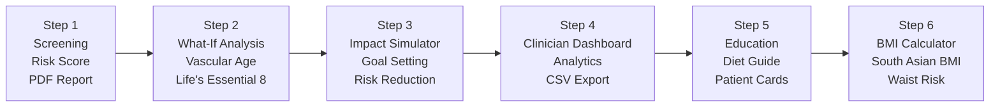

# The 6-Step Clinical Workflow — A Complete Walkthrough

*How a single patient moves through CalciTrack from first data entry to clinical action*

---

## The Diagram

---

## What This Diagram Shows

This is the **complete clinical journey** within CalciTrack — six sequential steps that take a patient from their first risk assessment all the way through education, community tracking, and physical health metrics.

Each step has a distinct purpose. Together, they form a **comprehensive, doorstep-ready cardiac screening system** that any trained community health worker can use — not just a specialist.

---

## Step 1 — Screening: Where Everything Begins

**What happens here:**
The health worker enters the patient's basic information: age, sex, blood pressure, smoking status, diabetes, and any known risk factors. If lab values are available (Lp(a), hs-CRP), they are entered here too.

In under two minutes, CalciTrack produces:

- **The 10-year risk percentage** — the probability of a cardiovascular event in the next decade
- **A visual risk gauge** — a colour-coded speedometer (green/orange/red) that anyone can read at a glance
- **The risk tier** — LOW, INTERMEDIATE, HIGH, or HIGH (UPGRADED)
- **A clinical narrative** — a plain-English triage recommendation
- **The vascular age** — how old the patient's heart actually is
- **A follow-up date** — when they should be rescreened
- **A Heart Health Certificate** — a printable PDF document, personalised for the patient
- **A WhatsApp referral message** — pre-filled with the patient's risk result, ready to send to a specialist in one tap

**Who uses this step:**
Everyone who is screened. This is the core of CalciTrack and the reason it was built.

---

## Step 2 — What-If Analysis: Showing What Is Possible

**What happens here:**
After a patient receives their risk result, the natural question is: *"What if I change?"*

Step 2 answers that question by showing the patient two vascular ages side by side:

- **Current Vascular Age** — their heart's age today, with all their current risk factors
- **Optimised Vascular Age** — what their heart's age would be if they controlled their blood pressure, quit smoking, and managed their diabetes

The gap between these two numbers — measured in biological years — is the **most powerful motivational tool in preventive medicine**. It converts an abstract risk score into a personal, human reality.

**The Life's Essential 8 Checklist:**
This step also includes the AHA Life's Essential 8 framework — eight sliders for the eight most important cardiovascular health metrics:
1. Diet quality
2. Physical activity
3. Nicotine/tobacco use
4. Sleep duration
5. Weight (BMI)
6. Cholesterol levels
7. Blood glucose
8. Blood pressure

Each slider produces a score from 0 to 100. The composite score shows the patient where they stand across all dimensions of cardiovascular health — and where they have the most room to improve.

**Why this matters:**
Knowing your risk is the beginning. Understanding what is changeable — and seeing the quantified impact of change — is what drives behaviour modification. Step 2 transforms a risk score into a conversation about agency.

---

## Step 3 — Impact Simulator: Setting Specific Goals

**What happens here:**
Step 3 takes the What-If concept and makes it concrete and controllable. The clinician or patient sets specific, realistic goals using interactive controls:

- **Target blood pressure** — set a specific SBP goal (e.g., bring SBP from 145 to 120)
- **Quit smoking** — toggle on/off
- **Manage diabetes** — toggle on/off

As the goals are adjusted, two risk gauges update in real time:
- The **current risk gauge** (left) — where the patient is now
- The **projected risk gauge** (right) — where the patient would be after achieving the goals

The **risk reduction percentage** is shown between the two gauges — the exact quantification of what the chosen goals would achieve.

**Why this matters:**
Motivational interviewing — the clinical technique of helping patients identify their own reasons for change — is most effective when the patient can see a concrete, personalised outcome. "If you bring your blood pressure under 120 and stop smoking, your 10-year risk drops from 24% to 11%" is a very different message than "you should try to be healthier."

---

## Step 4 — Clinician Dashboard: Managing the Camp or Clinic

**What happens here:**
Step 4 is designed for the clinician or health camp organiser, not the individual patient. It gives an **overview of everyone screened in the current session**.

**Features:**
- **Session patient table** — every patient screened, with their name, age, sex, risk %, and tier
- **Summary metrics** — total screened, number in each risk tier, average risk %
- **Visual analytics:**
  - Bar chart: How many patients are LOW / INTERMEDIATE / HIGH?
  - Bar chart: Age group distribution of those screened
  - Bar chart: Gender breakdown
- **CSV export** — download the complete session data as a spreadsheet for follow-up coordination, referral tracking, and medical records

**Why this matters:**
CalciTrack is designed for **cardiac screening camps** — community health events where 20, 50, or 100 people might be screened in a single day. At the end of the camp, the clinician needs to know: How many people need urgent referral? What is the age and gender profile of this community? Who needs to be called back?

The Clinician Dashboard answers all of these questions in one view and makes the data portable and storable.

---

## Step 5 — Education and Diet Guide: Closing the Knowledge Gap

**What happens here:**
Step 5 is the **patient-facing educational interface** — designed to be shown directly to patients or used as a teaching tool.

### Patient Education Cards
Six expandable cards that explain complex medical concepts in plain language:

- **What is Lp(a)?** — Explained as the "genetic cholesterol" that statins can't touch
- **What is hs-CRP?** — Explained as the fire alarm for inflammation inside your arteries
- **What is Vascular Age?** — Explained through the heart-is-older-than-you metaphor
- **What is a CAC Score?** — Explained as an X-ray that counts calcium in your artery walls
- **What is ASCVD Risk?** — Explained as your personal cardiovascular weather forecast

### South Asian Diet Guide
A culturally tailored nutrition guide featuring:
- **Smart food swaps** — Ghee → Olive/coconut oil; White rice → Millet or brown rice; Maida → Whole wheat atta; Refined sugar → Jaggery in moderation
- **Heart-protective protein sources** — Dal, legumes, nuts, fish (for non-vegetarians)
- **The Indian Heart Plate** — A visual guide to proportions: half the plate as vegetables, a quarter as whole grains, a quarter as protein
- **Heart-protective spices** — Turmeric (anti-inflammatory), Ginger (reduces triglycerides), Garlic (lowers BP), Fenugreek (improves insulin sensitivity)

**Why this matters:**
Screening is only valuable if patients understand their results and know what to do. Education converts a number into behaviour change. The South Asian diet guide is culturally specific — it meets patients where they are, in the food traditions they actually live with.

---

## Step 6 — BMI Calculator: The Right Thresholds for the Right Population

**What happens here:**
Step 6 is a standalone BMI and waist circumference calculator using **South Asian-specific thresholds**.

**Inputs:**
- Weight (kg)
- Height (cm)
- Waist circumference (cm)
- Sex

**Outputs:**
- BMI value
- BMI category using South Asian thresholds (Normal / Overweight / Obese)
- Waist circumference risk assessment
- Side-by-side comparison table: Standard vs South Asian thresholds

**Why this matters:**
A South Asian patient with BMI 27 would be classified as "overweight but not obese" by a standard calculator. CalciTrack correctly classifies them as **obese** — because the metabolic damage happens at lower BMI in South Asian bodies. This affects treatment decisions, medication thresholds, and lifestyle advice.

Similarly, a South Asian woman with a 84 cm waist would be told she is safe by a standard tool. CalciTrack correctly flags her as at elevated metabolic risk — because the South Asian safe zone ends at 80 cm, not 88 cm.

---

## The Workflow as a System

Each step builds on the one before it:

| Step | Purpose | Who Benefits |
|---|---|---|
| 1 — Screening | Identify risk | Patient: knows their risk |
| 2 — What-If | Show possibility | Patient: sees what change achieves |
| 3 — Simulator | Set goals | Clinician + Patient: make a plan together |
| 4 — Dashboard | Track the community | Clinician: manages the camp and follow-up |
| 5 — Education | Build understanding | Patient: understands and can act |
| 6 — BMI | Complete the physical picture | Patient + Clinician: full metabolic profile |

Together, these six steps create a **complete preventive cardiology encounter** — from first contact to clinical action, in a format that works at a doorstep, a community centre, or a primary care clinic.

---

*Part of the CalciTrack Documentation Series — see the [docs folder](../docs/) for all guides*

---

> **CalciTrack** · Invented by Sai Keerthana Cherukuri · MS4 Clinical Innovation Project
> *Detect Early · Stratify Precisely · Prevent Effectively*
