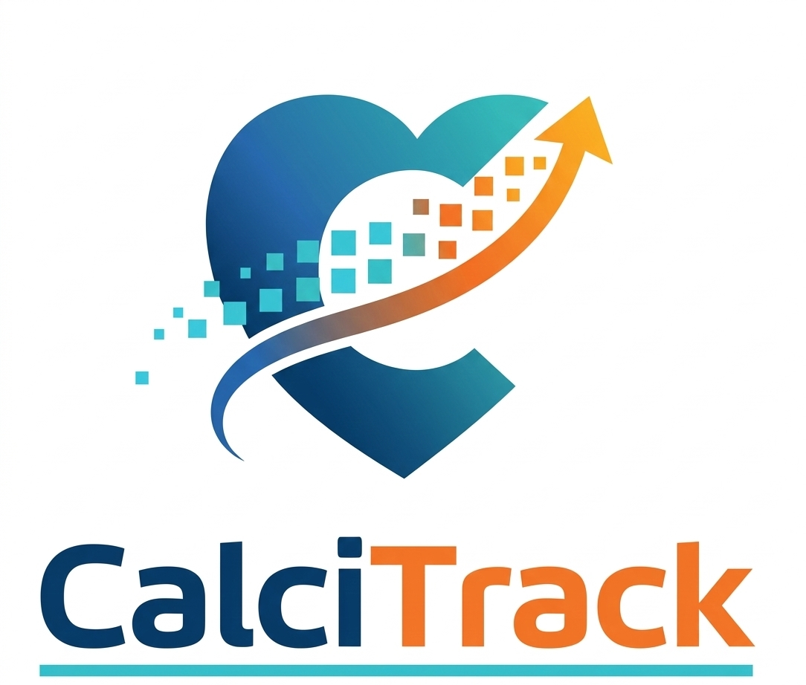

# CalciTrack — Plain English Documentation

> *For clinicians, evaluators, conference attendees, and anyone who wants to understand how this tool works — without needing a mathematics degree.*

---

## What Is This Folder?

This folder contains six plain-English documents that explain every diagram, formula, and clinical decision in CalciTrack.

Each document has:
- The actual flow diagram from the tool
- A plain-English explanation of what the diagram shows
- A step-by-step walkthrough of the logic
- The clinical evidence behind every number and threshold
- Real patient examples to make the concepts concrete

---

## Documents in This Folder

| # | Document | What It Explains |
|---|---|---|
| 01 | [System Overview](01-System-Overview.md) | The complete patient journey — from data entry to clinical recommendation |
| 02 | [Risk Formula Explained](02-Risk-Formula-Explained.md) | How the 10-year risk % is calculated — every number, every reason |
| 03 | [Decision Tree Explained](03-Decision-Tree-Explained.md) | How Lp(a) and hs-CRP catch hidden high-risk patients |
| 04 | [South Asian Lens](04-South-Asian-Lens.md) | Why standard calculators fail South Asians — and how CalciTrack corrects this |
| 05 | [Vascular Age Explained](05-Vascular-Age-Explained.md) | Why your heart may be biologically older than your age — and how we calculate it |
| 06 | [Clinical Workflow](06-Clinical-Workflow.md) | A complete walkthrough of all 6 steps from screening to education |

---

## Who Should Read This?

- **Cardiologists and physicians** evaluating the clinical validity of the tool
- **Conference panel members** assessing the innovation
- **Community health workers** wanting to understand the logic behind the tool they use
- **Patients and patient advocates** who want to understand how their risk was calculated
- **Medical students and researchers** studying cardiovascular risk in South Asian populations

---

## The Core Idea in One Paragraph

CalciTrack calculates your 10-year risk of a heart attack or stroke using a formula that has been specifically adjusted for South Asian patients. It uses age, blood pressure, smoking, diabetes, and several other factors — each with a carefully chosen weight based on clinical evidence. If the result places you in the middle risk zone (not clearly safe, not clearly dangerous), the tool then checks two specific blood tests — Lp(a) and hs-CRP — that reveal hidden risk the basic score cannot see. If either is elevated, the patient is automatically reclassified as high risk and recommended for immediate treatment. Throughout, the tool uses South Asian-specific thresholds for BMI and waist circumference — because the same body carries more risk in a South Asian frame than a Western one.

---

> **CalciTrack** · Invented by Sai Keerthana Cherukuri · MS4 Clinical Innovation Project
> *Detect Early · Stratify Precisely · Prevent Effectively*
